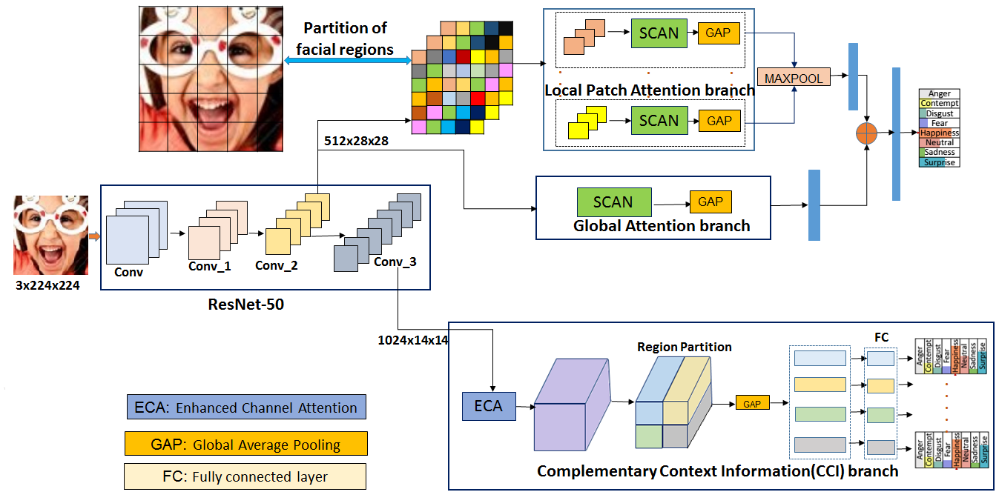
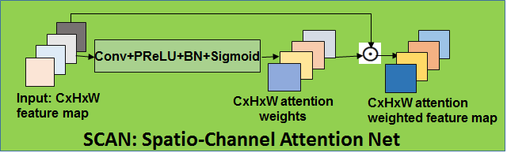
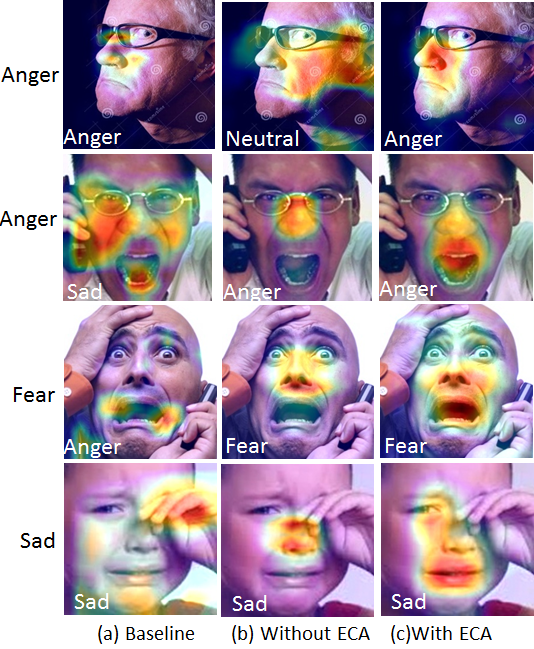
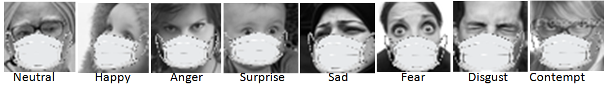
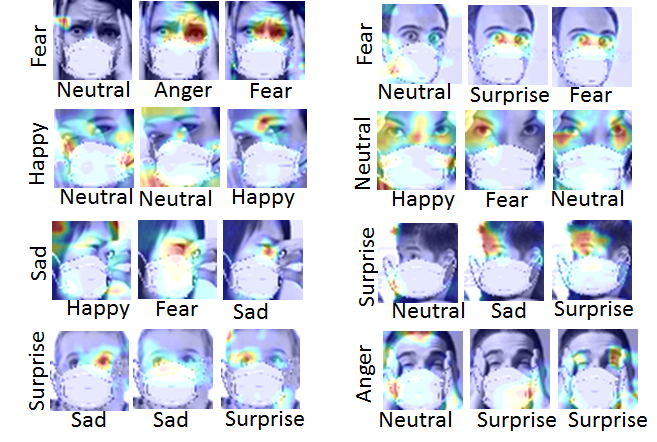

Our work has been published in Pattern Recognition letters.

https://authors.elsevier.com/a/1ca-7cAmylz0f

https://www.sciencedirect.com/science/article/abs/pii/S0167865521000489#absh0002

<strong>Title:</strong> Landmark Guidance Independent Spatio-channel Attention and Complementary Context Information based Facial Expression Recognition

https://arxiv.org/pdf/2007.10298v1.pdf

<strong> Our proposed FER framework:<strong>

<em> Activation maps using GRADCAM for few of FEDRO images are shown below:</em>

<mark>Example of our synthetic created masked face images from FERPLUS dataset are shown below:</mark>

<em>Comparision of activation maps using GRADCAM between Baseline3, RAN and Our model for masked face images on FERPlus are shown below:</em>
  

Note: Our trained model checkpoints will be made available after publication. 

Citation: 
@article{gera2020landmark,
  title={Landmark Guidance Independent Spatio-channel Attention and Complementary Context Information based Facial Expression Recognition},
  author={Gera, Darshan and Balasubramanian, S},
  journal={arXiv preprint arXiv:2007.10298},
  year={2020}
}

Acknowledgments:
We dedicate this work to Bhagawan Sri Sathya Sai Baba, Divine Founder Chancellor of Sri Sathya Sai Institute of Higher Learning, PrasanthiNilyam, A.P., India.

