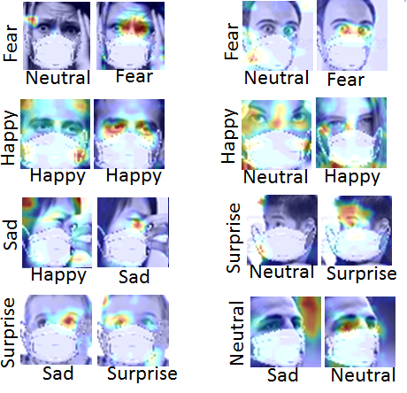

Title: Landmark Guidance Independent Spatio-channel Attention and Complementary Context Information based Facial Expression Recognition

https://arxiv.org/pdf/2007.10298v1.pdf

Our proposed FER framework:

Activation maps using GRADCAM for few of FEDRO images are shown below:

